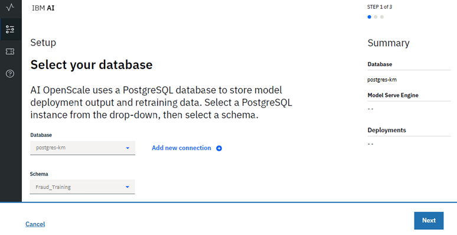

---

copyright:
  years: 2015, 2018
lastupdated: "2018-9-12"

---

{:shortdesc: .shortdesc}
{:new_window: target="_blank"}
{:tip: .tip}
{:pre: .pre}
{:codeblock: .codeblock}
{:screen: .screen}

# Specify your database
{: #connect-db}

Your first step in the {{site.data.keyword.aios_short}} tool is to specify a database.
{: shortdesc}

## Connecting to your database
{: #connect-config-db}

{{site.data.keyword.aios_short}} uses a database to store payload, feedback, and measurement data. Besides selecting a database, you will also select a schema for your database - a schema is a named collection of tables in the database.

**Note**: For the current release, only a PostgreSQL database is supported. The PostgreSQL database needs to be in the same {{site.data.keyword.Bluemix_notm}} account where the {{site.data.keyword.aios_short}} instance is located.

1.  From the home page of the {{site.data.keyword.aios_short}} tool, click **Begin**.

    

1.  {{site.data.keyword.aios_short}} checks your {{site.data.keyword.Bluemix_notm}} account to locate any existing databases. You can then select a database from the **Database** drop-down menu.

    

    You can also select the **Add new connection** link to purchase a new Postgres instance in {{site.data.keyword.Bluemix_notm}}.

    Click **Next**.

1.  Once you have selected a database, select a **Schema** for that database.

    

1.  Click **Next**.

### Next steps
{: #connect-next}

{{site.data.keyword.aios_short}} is now ready for you to configure your [Watson Machine Learning service instance](connect-wml.html).
