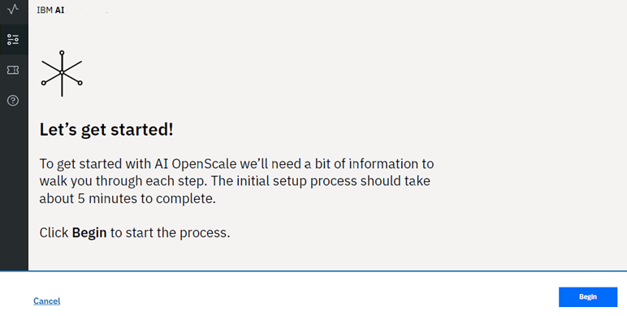
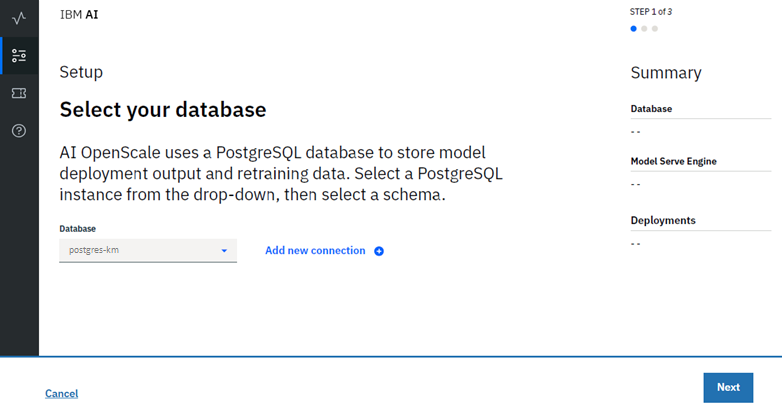
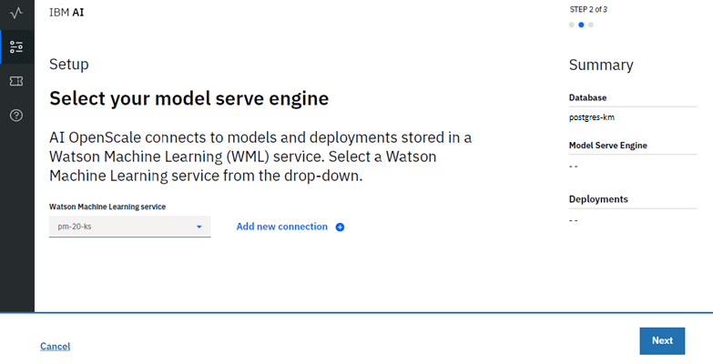
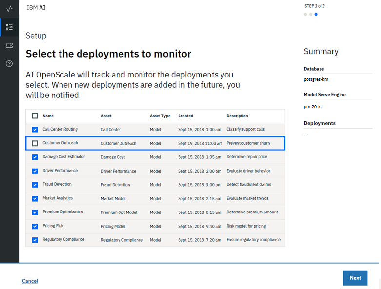

---

copyright:
  years: 2018
lastupdated: "2018-10-04"

---

{:shortdesc: .shortdesc}
{:new_window: target="_blank"}
{:tip: .tip}
{:pre: .pre}
{:codeblock: .codeblock}
{:screen: .screen}

# Getting started
{: #gettingstarted}

This topic provides reference material and first steps to help you get started using {{site.data.keyword.aios_full}}.
{: shortdesc}

## View the {{site.data.keyword.aios_short}} demo
{: #gs-view-demo}

Experience the look and feel of {{site.data.keyword.aios_short}} by viewing an [interactive demonstration](https://www.ibm.com/cloud/garage/demo/try-ai-openscale).

## Complete the tutorial (recommended)
{: #gs-tutorial}

A full list of prerequisites, along with step-by-step instructions for provisioning {{site.data.keyword.Bluemix_notm}} machine learning and data services, creating and deploying machine learning models, and configuring the new {{site.data.keyword.aios_full}} service to monitor your models for trust and transparency, can be [found in the tutorial](/docs/services/ai-openscale/tutorial.html).

## Manually configure {{site.data.keyword.aios_short}}
{: #gs-manual}

The following steps outline the process that is required to configure {{site.data.keyword.aios_short}} using your own data and models. It is recommended that you [complete the tutorial](/docs/services/ai-openscale/tutorial.html) to become familiar with the process. ***At a minimum***, you will need:

1.  An {{site.data.keyword.aios_short}} service instance.

    - Go to the [{{site.data.keyword.aios_short}}](https://console.bluemix.net/catalog/services/ai-openscale) page in the {{site.data.keyword.Bluemix_notm}} Catalog.

    - Sign up for a free {{site.data.keyword.Bluemix_notm}} account or log in with an existing account.

    - Click **Create**.

1.  A PostgreSQL database connected to your {{site.data.keyword.Bluemix_notm}} account.

    **Note**: For the current release, only a PostgreSQL database is supported.

    **Note**: The PostgreSQL database must be present in the same {{site.data.keyword.Bluemix_notm}} account as the {{site.data.keyword.aios_short}} instance.

    - To provision a new PostgreSQL database instance, access the [**Compose for PostgreSQL** landing page ](https://console.bluemix.net/catalog/services/compose-for-postgresql) in {{site.data.keyword.Bluemix_notm}}.

1.  A Watson Machine Learning (WML) service instance connected to your {{site.data.keyword.Bluemix_notm}} account.

    **Note**: For the current release, only the Watson Machine Learning framework is supported.

    **Note**: The WML service instance must be present in the same {{site.data.keyword.Bluemix_notm}} account as the {{site.data.keyword.aios_short}} instance.

    - To provision a new Watson Machine Learning service instance, access the [**Machine Learning** landing page ](https://console.bluemix.net/catalog/services/machine-learning) in {{site.data.keyword.Bluemix_notm}}.

1.  An AI model, deployed in the WML service instance.

    - The model can be any type (Spark ML, Deep learning, etc.), and should have an output schema defined.

    - The model training data must be available in either Cloud Object Storage, or in Db2. Access to the training data is not mandatory, but without it you will not be able to configure bias checking. See [Configuring the Fairness monitor](/docs/services/ai-openscale/monitor-fairness.html#config-fair) for more details.

    - If the model is accepting structured data as input, the model training data must be available in either Cloud Object Storage, or in Db2 for explainability to work. See [Configuring the Explainability monitor](/docs/services/ai-openscale/monitor-explain.html#config-explain).

    - If your AI model is deployed in a machine learning engine other than WML, you must enable payload logging for the external machine learning engine with a Python client. See [Working with other Machine Learning engines](/docs/services/ai-openscale/connect-ml.html) for more information.

## Step 1: Specify your database
{: #gs-config-db}

Your first step in the {{site.data.keyword.aios_short}} tool is to specify a database. This is the database that {{site.data.keyword.aios_short}} uses to store your model deployment output, deployment feedback, and retraining data.

You will also select a schema for your database. A schema is a named collection of tables in the database.

1.  From the home page of the {{site.data.keyword.aios_short}} tool, click **Begin**.

    

1.  Select a database from the **Database** drop-down menu.

    

1.  Select a **Schema** for that database.

    

1.  Click **Next**.

## Step 2: Specify your Watson Machine Learning service instance
{: #gs-config-ml}

Now, specify your Watson Machine Learning instance. This is where you store your AI models and deployments.

1.  Select an instance from the **Watson Machine Learning service** drop-down menu.

    

1.  Click **Next**.

## Step 3: Select which deployments to monitor
{: #gs-config-deploys}

1.  From the list of model deployments stored in your WML instance, select which deployments you will monitor.

    

1.  Click **Next**.
1.  Click **Save**.

You have successfully configured {{site.data.keyword.aios_short}}.

## Next steps
{: #gs-next-steps}

- [Configure monitors](/docs/services/ai-openscale/monitor-overview.html) for each deployment you selected.
- [View monitored data](/docs/services/ai-openscale/insight-overview.html) in the {{site.data.keyword.aios_short}} dashboard.
