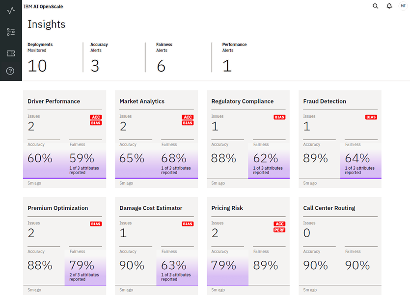
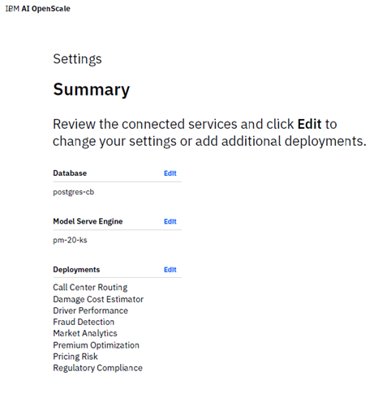

---

copyright:
  years: 2015, 2018
lastupdated: "2018-9-14"

---

{:shortdesc: .shortdesc}
{:new_window: target="_blank"}
{:tip: .tip}
{:pre: .pre}
{:codeblock: .codeblock}
{:screen: .screen}

# Navigating the dashboard
{: #insights}

You can track all the deployments you are monitoring through the {{site.data.keyword.aios_short}} dashboard. The dashboard is your main view into {{site.data.keyword.aios_short}}. The dashboard consists of four tabs:

  

{: shortdesc}

## Insights
{: #insight-dash-tab}

The Insights tab (  ) provides a high-level view of your deployment monitoring.

  

- ***Deployments Monitored*** - In this example, a total of 10 deployments are being monitored. Each deployment is shown as an individual tile below.

- ***Accuracy Alerts*** - A total of 3 Accuracy alerts are represented in the tiles below by both purple shading, and by a small `ACC` tag. In this example, the `Driver Performance`, `Market Analytics`, and `Pricing Risk` deployments show Accuracy values of `60%`, `65%`, and `79%`, respectively.

- ***Fairness Alerts*** - There are a total of 6 Fairness alerts, represented in the tiles below by both purple shading, and by a small `BIAS` tag. In this example, the `Driver Performance`, `Market Analytics`, `Regulatory Compliance`, `Fraud Detection`, `Premium Optimization`, and `Damage Cost Estimator` deployments show Fairness values of `59%`, `68%`, `62%`, `64%`, `79%`, and `63%`, respectively.

- ***Performance Alerts*** - The single performance alert is represented by a small `PERF` tag; in this example, on the `Pricing Risk` deployment.

Each tile provides a summary of monitoring activity for that deployment. Note that the `Call Center Routing` deployment tile shows no issues, indicating a fairly stable, accurate model.

### Next steps
{: #next-insight}

Select any of the individual deployment tiles to view more details about that deployment. See [Working with monitoring data](insight-timechart.html).

## Configuration
{: #insight-config-tab}

The Configuration tab (  ) opens a Configuration Summary for the selected deployment.

  

From here, you can directly edit the configuration settings for your deployment monitor.

## Transactions
{: #insight-transact-tab}

The Transactions tab (  ) lets you search a specific transaction ID to explain a particular deployment transaction. For more information, see [Monitoring Explainability](insight-timechart.html#insight-explain).

## Help tab
{: #insight-transact-tab}

The Help tab (  ) provides additional information to assist you in using {{site.data.keyword.aios_short}}.
